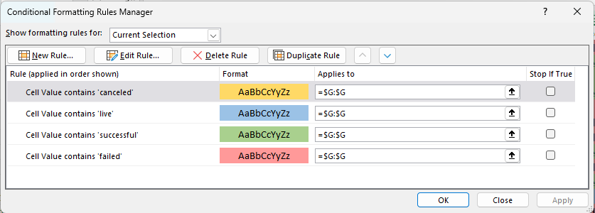
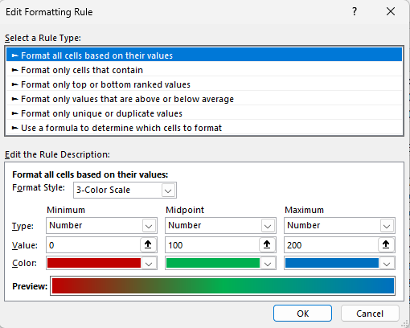
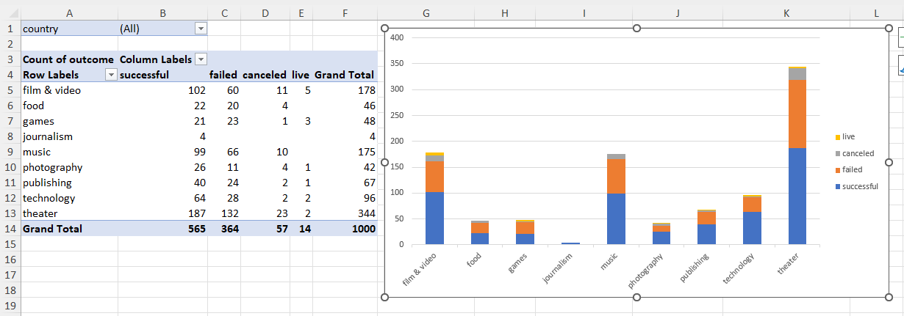
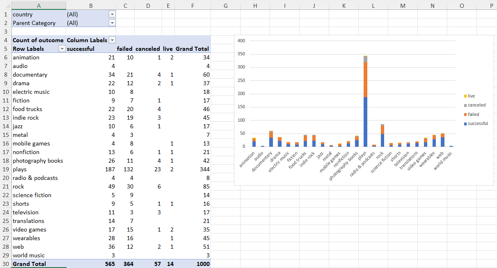
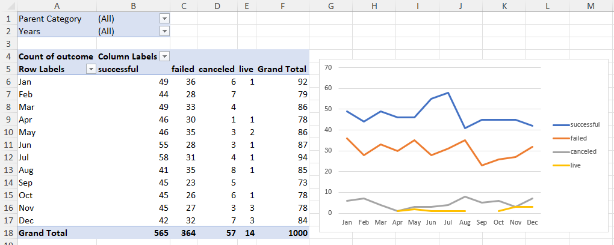
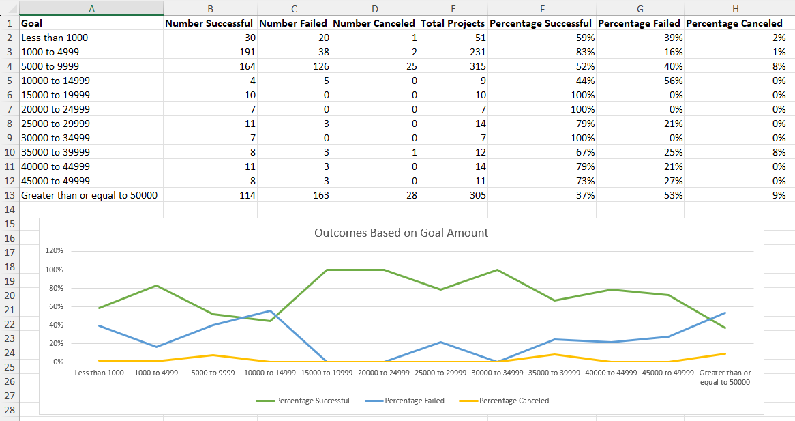
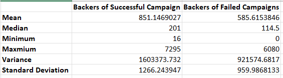

# Crowdfunding Campaign Analysis

## Introduction

As part of my GWU Data Analysis & Visualization Boot Camp, I was was tasked with organizing and analyzing a database of 1,000 generated sample crowdfunding projects using Excel.

Excel features used in this project include:
* Excel Formulas
* Conditional Formatting
* PivotTables
* Charts

## Excel Tasks Completed

1. Conditional Formatting<br>
I applied conditional formatting on the campaign outcome column.<br>


2. Excel Formala - Rounded Percent<br>
I created a column that calculates a rounded percent of the campaign funded using an Excel formula. Column E is the amount pledged and Column D is the campaign goal.
     ```
    =ROUND(E2/D2*100,0)
     ```
3. Conditional Formatting<br>
I applied three-color scale conditional formatting to the newly created percent column.


4. Excel Formula - Average<br>
I created a column that calculates the average donation. Column H is the number of backers and Column E is the amount pledged.
     ```
    =ROUND(IF(H2=0,0,E2/H2),2)
     ```

5. Excel Formula - Text Split<br>
I split the category column (Column R), category/subcategory, into two columns, category and subcategory.
     ```
    =TEXTSPLIT(R2,"/")
     ```

6. PivotTable<br>
I created a PivotTable that analyzed campaign performance per category with a country filter and a stacked column chart.


7. PivotTable
I created a PivotTable that analyzed campaign performance per sub-category with a category and country filter and a stacked column chart.


8. Excel Formula - Unix Timestamp to Date<br>
I converted a unix timestamp column (Column L) to date column using a formula

     ```
     =(((L2/60)/60)/24)+DATE(1970,1,1)
     ```

9. PivotTable
I created a PivotTable that analyzed campaign performance by month with a category and year filter and a line chart.


10. Excel Formula - COUNTIF, SUM and Division<br>
I created a new table that analyzed campaign peformance based on campaign goal. I populated the data using the COUNTIF and SUM formulas and division. I used array names for cleaner code. I visualized the newly created data with a line chart.

     ```
     =COUNTIFS(goal,">=15000",goal,"<=19999",outcome,"successful")
     ```

11. Excel Formula - Statistics
I created a summary statistics table to analyze the backers of successful campaigns versus failed campaigns. I used the following formulas: AVERAGE, MEDIAN, MIN, MAX, VAR.P, and STDEV.P.


12. Lastly, I created a report in Microsoft Word with conclusions, limitations of the dataset, and other insights.

## Files Included
* CrowdfundingBook.xlsx - Original Excel Workbook
* CrowdfundingBook_Analyzed.xlsx - Organized and Analyzed Excel Workbook
* Crowdfunding_Analysis.docx - Report

## References
Data for this dataset was generated by edX Boot Camps LLC, and is intended for educational purposes only.